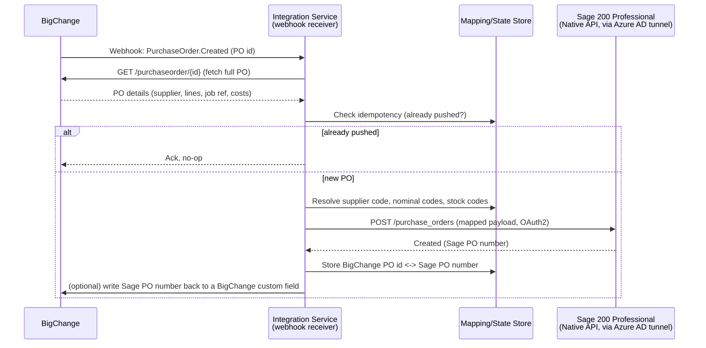

# BigChange → Sage200: Purchase Order Integration Plan

## Goal

When a purchase order (PO) is created in BigChange (JobWatch), automatically create the
matching purchase order in Sage 200 Professional — no manual re-keying.

## Confirmed: Sage 200 Professional

Sage 200 Professional (on-premise/desktop edition) **does have a REST API** — this was
corrected after initial research; middleware vendors like Codat not supporting Professional
doesn't mean no API exists, it means they haven't built a connector for it.

| | Detail |
|---|---|
| API | Sage 200 REST API, shared design across Standard and Professional (customers, suppliers, products, sales orders, **purchase orders**, nominal ledger, etc.) |
| Connection method | **Native API** — a lightweight "Azure AD Proxy Connector" installed on the Sage 200 server tunnels *outbound* to Microsoft Entra ID (Azure AD). No inbound firewall rule, no public-facing web server required |
| Requirements | A Microsoft 365 subscription (admin access to activate/configure), Sage 200 Professional Summer 2018 Remastered / 2020 R1 or later |
| Auth | OAuth 2.0 |
| Older alternative | A "Classic" connection method exposing an IIS web server directly to the internet — more setup and larger attack surface, generally superseded by the Native API |
| Still to confirm | The live API reference for Professional (`developer.sage.com/200-uk/apis/sage-200-professional`) returned a 403 during research and needs checking directly (with a developer account) to confirm the Purchase Order resource specifically supports **write/create**, not just read |

This removes the need for an on-prem Windows agent or the SDK/Business Object Model —
a hosted webhook receiver can call Sage 200 Professional's REST API in much the same way
it would Sage 200 Standard's, once the Native API tunnel is set up on the Sage 200 server
by the customer's IT/Sage partner.

## Architecture

If BigChange turns out not to support a webhook event for purchase orders specifically
(needs confirming against their developer portal — see Open Questions), fall back to a
**scheduled poll**: every N minutes, call BigChange's PO list/search endpoint filtered by
`modifiedSince`, and process anything new. The rest of the pipeline is unchanged.

The integration service itself can now be a normal hosted service (cloud function or small
container) — it doesn't need to live inside the customer's network, since the Sage 200
Professional site is reachable via the Native API's Azure AD tunnel once that's configured.

## Data mapping (draft — needs field-level confirmation)

| BigChange PO field | Sage200 PO field | Notes |
|---|---|---|
| PO number / external ID | Order reference | Also stored as the idempotency key |
| Supplier | Supplier account code | Requires a supplier mapping table — BigChange supplier ≠ Sage supplier account code by default |
| Order lines (item, qty, unit cost) | Order lines (stock/product code, qty, unit price) | Requires a product/stock code mapping table |
| Job / site reference | Analysis code or order note | For cost-centre reporting back in Sage |
| Delivery address | Delivery address | May default to a fixed warehouse/site address |
| Nominal code (if set in BigChange) | Nominal code | Only if BigChange POs carry nominal coding; otherwise Sage's default per supplier/product applies |

Suppliers and stock/product codes are assumed to **already exist in both systems** — this
integration does not create master data, only transactional POs. A mapping table (BigChange
ID → Sage200 code) is required for both suppliers and products before Phase 1 can run
end-to-end.

## Key design points

- **Idempotency**: webhooks can fire more than once. Before creating a Sage PO, check a
  small state store (even a simple table/file) keyed by BigChange PO id. If already
  pushed, no-op.
- **Auth/secrets**: BigChange API key and Sage 200 OAuth2 client credentials are both
  secrets — environment variables / a secrets manager, never committed to the repo.
- **Webhook verification**: if BigChange signs its webhook payloads (HMAC), verify the
  signature before processing — otherwise the endpoint is spoofable.
- **Error handling**: failed pushes (e.g. missing supplier mapping) go to a retry queue /
  dead-letter log with alerting, rather than silently dropping the PO.
- **Traceability**: writing the resulting Sage200 PO number back to BigChange (custom
  field or note) closes the loop for whoever raised the PO.
- **On-prem prerequisite**: someone (customer's IT or Sage partner) needs to set up the
  Native API / Azure AD Proxy Connector on the Sage 200 server before the integration
  service can reach it at all — this is a one-time setup step, not part of the code.

## Open questions to resolve before building

1. **Purchase Order write support** — confirm via the actual Sage 200 Professional API
   reference (needs a developer account/login, blocked during research) that purchase
   orders can be **created**, not just read, and see the exact required/optional fields.
2. **Native API already set up?** — has the customer's Sage 200 site already got the Azure
   AD Proxy Connector and Microsoft 365 subscription in place, or does that need arranging
   first (likely via their Sage partner)?
3. **BigChange webhook support** — does BigChange's API expose a `PurchaseOrder.Created`
   (or similar) webhook event, or does this need to be a scheduled poll instead? Check
   `bigchange.com/rest-api` / the BigChange developer portal, or ask BigChange support.
4. **Supplier & product mapping ownership** — who maintains the BigChange↔Sage200 code
   mapping tables, and how are they updated when new suppliers/products are added?
5. **Nominal coding** — does BigChange capture nominal codes on a PO, or does Sage200's
   default coding per supplier/product apply?
6. **Credentials** — confirm both a BigChange API key and a registered Sage 200 OAuth2
   application (client id/secret) are available.

## Suggested phased rollout

1. **Phase 1 — manual/poll proof of concept**: a script that reads one known BigChange PO
   and creates the matching Sage200 PO via a one-off run against the Sage 200 Professional
   API. Validates field mapping and both APIs' auth without needing a hosted webhook
   endpoint yet.
2. **Phase 2 — automate the trigger**: move to a real webhook (or scheduled poll) with
   idempotency and error handling.
3. **Phase 3 — monitoring & reconciliation**: alerting on failed pushes, a daily
   reconciliation report comparing BigChange POs to Sage200 POs to catch anything missed.

## Next step

Get a Sage developer account to confirm question 1 (PO write support) against the real API
reference, and confirm question 2 (whether the Native API tunnel is already configured on
the customer's Sage 200 site). Those two determine whether Phase 1 can start immediately or
needs a setup step first.
