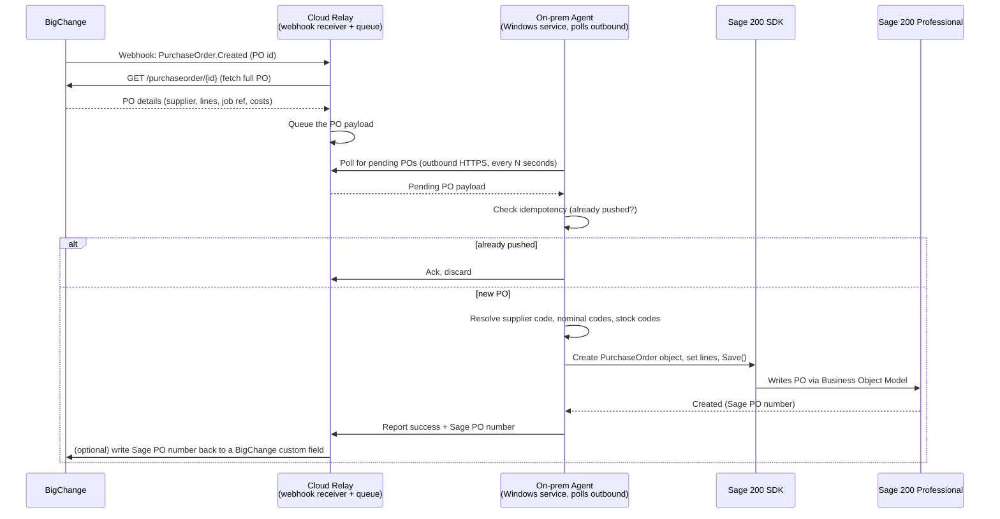

# BigChange → Sage200: Purchase Order Integration Plan

## Goal

When a purchase order (PO) is created in BigChange (JobWatch), automatically create the
matching purchase order in Sage 200 Professional — no manual re-keying.

## Confirmed: Sage 200 Professional

This is the on-premise/desktop edition. It has **no public REST API** — that's Sage 200
Standard only. This shapes the whole "push" side of the architecture:

| | Detail |
|---|---|
| Access method | **Sage 200 SDK / Business Object Model** — a .NET library that talks to Sage 200's own application layer (not raw SQL), so business rules, numbering, and validation are respected |
| Where it must run | On a machine with the Sage 200 client components installed, on the same network as the Sage 200 SQL Server — it cannot be called over the public internet |
| Third-party middleware | Ruled out — Codat and similar iPaaS tools only support Sage 200 Standard (cloud), not Professional/Extra |
| Direct SQL writes | Not recommended — writing PO tables directly bypasses Sage's business logic (numbering, VAT, stock updates) and risks data corruption. Only use the SDK/Business Object Model for writes |
| Licensing | The SDK connection may consume a **named user seat** — confirm with your Sage 200 reseller/partner before building, since an unattended integration user has a licensing cost |

## Architecture

Because Sage 200 Professional can only be reached from inside its own network, and
BigChange's webhook needs a public HTTPS endpoint to call, the two are bridged with a
small **cloud relay** in the middle. The on-prem side only ever makes outbound calls —
no inbound firewall rule needs opening on the customer's network.

**Why not a direct webhook straight to the on-prem machine?** It would need the customer's
firewall/router configured to accept inbound traffic from the internet to a Windows
service — high IT friction and a bigger attack surface. Routing through a small cloud
relay keeps BigChange's side genuinely event-driven while the on-prem agent stays
outbound-only, which is normally an easy sell to IT.

**Simpler fallback**: if a cloud relay is more infrastructure than wanted, the on-prem
agent can instead poll BigChange's API directly on a schedule (e.g. every 5 minutes,
filtered by `modifiedSince`) — no relay, no webhook, just one outbound-only service. Less
real-time, but meaningfully simpler to operate. Worth considering as the actual Phase 1/2
target unless near-real-time matters here.

## Data mapping (draft — needs field-level confirmation)

| BigChange PO field | Sage 200 field (via SDK) | Notes |
|---|---|---|
| PO number / external ID | Order reference / memo | Also stored as the idempotency key |
| Supplier | Supplier account reference | Requires a supplier mapping table — BigChange supplier ≠ Sage account reference by default |
| Order lines (item, qty, unit cost) | Order lines (stock code, qty, unit price) | Requires a product/stock code mapping table |
| Job / site reference | Analysis code or order note | For cost-centre reporting back in Sage |
| Delivery address | Delivery address | May default to a fixed warehouse/site address |
| Nominal code (if set in BigChange) | Nominal code | Only if BigChange POs carry nominal coding; otherwise Sage's default per supplier/product applies |

Suppliers and stock/product codes are assumed to **already exist in both systems** — this
integration does not create master data, only transactional POs. A mapping table (BigChange
ID → Sage account reference / stock code) is required before Phase 1 can run end-to-end.

## Key design points

- **Idempotency**: the relay or a retry can cause the same PO to be seen twice. Before
  creating a Sage PO, check a small state store (even a simple table/file) keyed by
  BigChange PO id. If already pushed, no-op.
- **Auth/secrets**: BigChange API key and the Sage 200 SDK connection credentials are both
  secrets — environment variables / a secrets manager on the on-prem machine, never
  committed to the repo.
- **Webhook verification**: if BigChange signs its webhook payloads (HMAC), the relay must
  verify the signature before queueing — otherwise the endpoint is spoofable.
- **Error handling**: failed pushes (e.g. missing supplier mapping) go to a retry queue /
  dead-letter log with alerting, rather than silently dropping the PO. The on-prem agent
  should log failures somewhere the customer's IT/finance team can actually see.
- **Traceability**: writing the resulting Sage PO number back to BigChange (custom field or
  note) closes the loop for whoever raised the PO.
- **.NET Framework**: the Sage 200 SDK is COM/.NET-Framework based (not .NET Core/5+), so
  the on-prem agent is realistically a Windows service written in C# targeting .NET
  Framework, deployed to a Windows machine with Sage 200 client components installed.

## Open questions to resolve before building

1. **On-prem hosting** — which Windows machine (server or a dedicated workstation) will
   run the agent, and does it have (or can it get) the Sage 200 client/SDK installed with
   network access to the Sage 200 SQL Server?
2. **SDK licensing** — does the integration need a dedicated named-user seat, and is one
   available/budgeted?
3. **BigChange webhook support** — does BigChange's API expose a `PurchaseOrder.Created`
   (or similar) webhook event, or does this need to be a scheduled poll instead? Check
   `bigchange.com/rest-api` / the BigChange developer portal, or ask BigChange support.
4. **Relay vs. simple poll** — is near-real-time worth the extra cloud relay component, or
   is a straightforward "on-prem agent polls BigChange every few minutes" acceptable?
5. **Supplier & product mapping ownership** — who maintains the BigChange↔Sage200 code
   mapping tables, and how are they updated when new suppliers/products are added?
6. **Nominal coding** — does BigChange capture nominal codes on a PO, or does Sage's
   default coding per supplier/product apply?
7. **Credentials** — confirm a BigChange API key and valid Sage 200 SDK/login credentials
   are available for the integration user.

## Suggested phased rollout

1. **Phase 1 — local proof of concept**: a small C# console app on the Sage 200 machine
   using the SDK to create one hardcoded test PO. Validates SDK credentials, licensing, and
   the exact Business Object Model calls needed — before any BigChange involvement.
2. **Phase 2 — connect BigChange**: add the BigChange fetch (poll or webhook-via-relay) and
   field mapping, still run manually/on-demand.
3. **Phase 3 — automate + harden**: turn it into a proper Windows service with idempotency,
   retry/error handling, and logging.
4. **Phase 4 — monitoring & reconciliation**: alerting on failed pushes, a daily
   reconciliation report comparing BigChange POs to Sage200 POs to catch anything missed.

## Next step

Decide question 4 (relay vs. simple poll) and question 1 (hosting machine) — those two
determine what Phase 1 actually needs to be scaffolded as in this repo.
