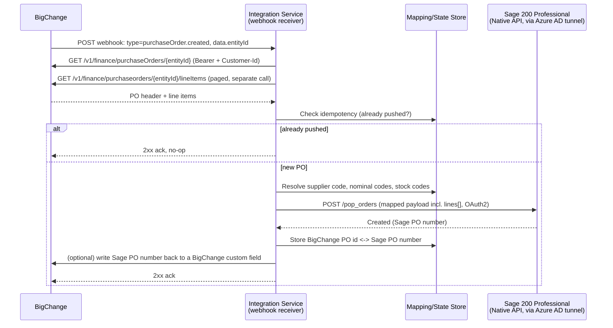

# BigChange → Sage200: Purchase Order Integration Plan

## Goal

When a purchase order (PO) is created in BigChange (JobWatch), automatically create the
matching purchase order in Sage 200 Professional — no manual re-keying.

## Confirmed: Sage 200 Professional

Sage 200 Professional (on-premise/desktop edition) **does have a REST API** — this was
corrected after initial research; middleware vendors like Codat not supporting Professional
doesn't mean no API exists, it means they haven't built a connector for it.

| | Detail |
|---|---|
| API | Sage 200 REST API, shared design across Standard and Professional (customers, suppliers, products, sales orders, **purchase orders**, nominal ledger, etc.) |
| Connection method | **Native API** — a lightweight "Azure AD Proxy Connector" installed on the Sage 200 server tunnels *outbound* to Microsoft Entra ID (Azure AD). No inbound firewall rule, no public-facing web server required |
| Requirements | A Microsoft 365 subscription (admin access to activate/configure), Sage 200 Professional Summer 2018 Remastered / 2020 R1 or later |
| Auth | OAuth 2.0 |
| Older alternative | A "Classic" connection method exposing an IIS web server directly to the internet — more setup and larger attack surface, generally superseded by the Native API |
| Base URL | `https://api.columbus.sage.com/uk/sage200extra/accounts/v1` (confirmed from the Sage 200 Professional OpenAPI spec) |

**PO write support is confirmed.** From the actual OpenAPI spec (Sage 200 Professional API,
version 2025.02):

- `POST /pop_orders` (`operationId: PostPOPOrder`) creates a purchase order. Lines are
  submitted **embedded in the same request** as a `lines[]` array — there's no separate
  "create line" call needed for a straightforward PO.
- `GET /pop_orders`, `PUT /pop_orders/{id}` also exist (list/update), plus
  `POST /pop_orders_duplicate` for cloning an existing order.
- `GET /suppliers` and `GET /products` exist as separate resources — needed because PO
  fields reference suppliers/products by **internal numeric Sage ID**, not by the
  human-readable account reference or product code (see mapping section below).

This removes the need for an on-prem Windows agent or the SDK/Business Object Model —
a hosted webhook receiver can call Sage 200 Professional's REST API in much the same way
it would Sage 200 Standard's, once the Native API tunnel is set up on the Sage 200 server
by the customer's IT/Sage partner.

## Confirmed: BigChange Purchase Order API

From the actual API reference (`developers.bigchange.com`):

| | Detail |
|---|---|
| Base URL | `https://api.bigchange.com/v1` |
| Get one PO | `GET /v1/finance/purchaseOrders/{purchaseOrderId}` (scope `finance:read`) |
| Create/Update | `POST` / `PUT` on the same `purchaseOrders` collection also exist (confirmed via the nav: "Create an purchase order", "Update a purchase order") — not needed for this integration since we only read from BigChange, but useful to know if the write-back-of-status idea gets built later |
| Auth | `Authorization: Bearer <token>` **and** a required `Customer-Id: <id>` header on every request — not just the token |
| Line items | **Separate resource**, not embedded in the PO response — `GET`/`POST`/`PUT`/`DELETE` line-item endpoints exist under the purchase order (exact path not yet pulled, but the pattern from other resources is `/v1/finance/purchaseOrders/{id}/lineItems`) |

**Confirmed PO header fields** (from the `GET` response schema):

`id`, `jobId` (nullable — the BigChange job this PO relates to), `jobGroupId` (nullable),
`contactId`, `seriesId` (nullable), `contractId` (nullable), `supplierId` (nullable —
**this is the field to map to Sage's `supplier_id`**), `createdAt`, `reference` (string —
**natural idempotency key**, maps to Sage's `document_no`), `currencyCode`,
`deliverySiteContactId` (nullable — points at a Contact record, not raw address fields;
resolving an actual delivery address means an extra Contacts lookup if needed),
`clientNotes`, `internalNotes`, `sentAt`, `cancelledAt`, `receivedAt`, `cost`,
`totalExclTax`, `totalInclTax`, `totalPaid`, `customFields[]`.

No embedded lines and no embedded delivery address — both need a follow-up call, so
fetching one PO fully is at minimum: `GET` the PO header, `GET` its line items, and
(optionally) `GET` the delivery contact.

## Architecture

**Webhook-triggered, confirmed against BigChange's actual webhook reference.** BigChange
has a general-purpose webhook system: you subscribe an API key to specific
`entity.operation` event types (e.g. `job.created`) via **API Key Management → Manage
webhooks** in the developer portal. Confirmed details:

- Webhook payload is deliberately thin — `{ id, createdAt, sentAt, customerId, type,
  data: { entityId } }`. It tells you *what changed*, not the full record; you then call
  the entity's `GET /v1/{entity}/{entityId}` endpoint to fetch current state.
- Child/line-item entities carry `parentEntityId`/`parentEntityType` in `data`, following
  a pattern like `GET /v1/jobs/{jobId}/lineItems/{lineItemId}` — if purchase order lines
  follow the same pattern, expect something similar for PO lines.
- BigChange handles webhook delivery retries itself: exponential backoff, capped at 15
  minutes between attempts, for up to 24 hours, then the message goes to a dead-letter
  queue accessible via their **FailedMessages** API — useful as a reconciliation backstop.
- The API key needs `webhooks:read` + `webhooks:write` scopes, plus a `*:read` scope for
  every entity subscribed to.
- **Confirmed**: `purchaseOrder.created`, `purchaseOrder.modified`, and
  `purchaseOrder.deleted` are all available as subscribable events — checked directly in
  the portal's webhook entity list.
- **Still unconfirmed**: whether webhook payloads are signed (e.g. HMAC) for verification —
  not mentioned in the reference page seen so far.

The integration service itself can now be a normal hosted service (cloud function or small
container) — it doesn't need to live inside the customer's network, since the Sage 200
Professional site is reachable via the Native API's Azure AD tunnel once that's configured.

## Data mapping (BigChange `purchaseOrders` → Sage `POST /pop_orders`)

**Header (order-level) fields** — both sides now confirmed from real schemas:

| BigChange field | Sage `pop_orders` field | Notes |
|---|---|---|
| `reference` | `document_no` | Natural idempotency key on both ends |
| `supplierId` | `supplier_id` (integer) | **Both are internal numeric IDs, but from different systems** — BigChange's `supplierId` must be resolved to Sage's `supplier_id` via a mapping table (there's no shared identifier, so this can't be a direct pass-through; needs matching by supplier name/account code set up once, then cached) |
| `createdAt` | `document_date` | ISO 8601 on both sides |
| — (not on PO header; would need `jobId` → job lookup if a requested delivery date exists on the job) | `requested_delivery_date` | BigChange's PO schema has no delivery-date field directly — check the job record via `jobId`, or leave unset |
| `jobId` | `analysis_code_1`..`analysis_code_20` | Ties the Sage PO back to the originating BigChange job for cost-centre reporting |
| `deliverySiteContactId` → (extra `GET` on Contacts) | `delivery_address` object | Requires a second lookup call; BigChange doesn't return address fields inline on the PO |
| `clientNotes` / `internalNotes` | order note / memo | Optional |

**Line fields** — BigChange's line items are a **separate, paginated resource**:
`GET /v1/finance/purchaseorders/{purchaseOrderId}/lineItems` to list, and
`POST /v1/finance/purchaseorders/{purchaseOrderId}/lineItems` (scope `finance:write`) to
create — both need the `Customer-Id` header, same as the PO header call. Confirmed field
schema, from the create endpoint's request body:

`contactId` (nullable), `quantity` (required), `description`, `taxId` (nullable),
`unitCost` (nullable), `unitSellingPrice`, `nominalCodeId` (nullable), `departmentCodeId`
(nullable).

**Important finding: BigChange PO lines have no product/stock catalog reference at
all** — no `productId`, no stock code, nothing. They're free-text (`description`) plus
cost/tax/nominal coding. This changes the plan: the "map BigChange product → Sage
`product_id`" lookup table originally assumed likely **isn't needed** — instead, Sage lines
should be created as **non-stock / free-text lines**, using whatever `line_type` Sage's API
supports for that (the `pop_orders.lines[]` schema had both `product_id` and a separate
`code`/`description` pair, suggesting non-stock lines are supported; the exact `line_type`
enum values still need confirming — e.g. by checking Sage's reference-data endpoint for
line types, or the desktop client's "non-stock item" PO entry option).

| BigChange line field | Sage `pop_orders.lines[]` field | Notes |
|---|---|---|
| `quantity` | `line_quantity` | Direct mapping |
| `unitCost` | `unit_buying_price` | Direct mapping. (`unitSellingPrice` on BigChange has no Sage PO equivalent — POs are a buying document; ignore it here) |
| `description` | `description` (+ `use_description: true`) | Direct mapping — this is the only "what is this line" data BigChange gives us |
| `nominalCodeId` | `nominal_reference` | Both are internal IDs from different systems — needs its own mapping table (BigChange nominal code → Sage nominal code) |
| `departmentCodeId` | `nominal_department` | Same — separate mapping table |
| `taxId` | `tax_code_id` | Also two different internal ID systems — needs its own mapping table |
| `contactId` (line-level) | — | Purpose unclear (a per-line contact, distinct from the PO's own `contactId`/`supplierId`) — likely not needed for the Sage push, flagged for later if it turns out to matter |

Suppliers are assumed to **already exist in both systems** and need one mapping table:
BigChange `supplierId` → Sage `supplier_id`. Nominal codes, department codes, and tax
codes each need their own small mapping table too (BigChange ID → Sage ID) — these are
typically a fixed, short list (a handful of nominal codes, a handful of tax rates) that
can be set up once as static config rather than looked up dynamically per push.

**Remaining unknowns**: Sage's `line_type` values for non-stock lines (needed to actually
build a working line payload), and whether BigChange signs webhook payloads. Both are
small, targeted checks rather than open architecture questions at this point.

### Building the supplier mapping table

Pulled a real page of production data from `GET /v1/finance/purchaseOrders` (100 POs) to
gauge scope: roughly **20 distinct `supplierId` values** on that single page alone (more
likely exist across other pages), with one supplier ID appearing far more often than any
other — the natural first candidate for a mapping row. (Raw production data — supplier
IDs, job references, customer details — deliberately not copied into this repo; kept to
chat/working notes instead.)

To build the mapping table for real:
1. For each distinct BigChange `supplierId`, look up its name (via BigChange's
   Contacts/supplier lookup — not yet confirmed which endpoint holds supplier names, since
   `purchaseOrders` only returns the numeric ID).
2. Match each name against Sage 200's supplier list (desktop client, or `GET /suppliers`
   once OAuth2 credentials are available) to get the Sage account code/internal ID.
3. Record each pair in the mapping config.

**For Phase 1**, only one row is needed: the single most-frequent supplier, matched to its
Sage counterpart — enough to validate the full pipeline end-to-end on a realistic, common
case before investing in mapping the full supplier list.

## Key design points

- **Idempotency**: BigChange retries webhook delivery on any non-2xx response (up to 24
  hours), so duplicate deliveries are expected, not just theoretical. Before creating a
  Sage PO, check a small state store (even a simple table/file) keyed by BigChange PO id.
  If already pushed, no-op and still return 2xx.
- **Respond fast, process async**: since BigChange retries on failure/timeout, the webhook
  handler should acknowledge quickly (2xx) and do the Sage push in the background — a slow
  Sage 200 API call blocking the webhook response risks BigChange treating it as a failed
  delivery and retrying unnecessarily.
- **Auth/secrets**: BigChange API key and Sage 200 OAuth2 client credentials are both
  secrets — environment variables / a secrets manager, never committed to the repo.
- **Webhook verification**: needs confirming whether BigChange signs payloads (e.g. HMAC
  header) — not seen in the reference docs so far. If not, rely on an unguessable endpoint
  URL and/or IP allowlisting instead.
- **Error handling**: failed pushes to Sage (e.g. missing supplier mapping) go to a retry
  queue / dead-letter log with alerting, rather than silently dropping the PO. BigChange's
  own FailedMessages endpoint is a useful secondary backstop for delivery-level failures.
- **Traceability**: writing the resulting Sage200 PO number back to BigChange (custom
  field or note) closes the loop for whoever raised the PO.
- **On-prem prerequisite**: someone (customer's IT or Sage partner) needs to set up the
  Native API / Azure AD Proxy Connector on the Sage 200 server before the integration
  service can reach it at all — this is a one-time setup step, not part of the code.

## Open questions to resolve before building

1. ~~Purchase Order write support~~ — **Confirmed.** `POST /pop_orders` creates a PO with
   embedded lines, per the Sage 200 Professional OpenAPI spec (v2025.02).
2. **Native API already set up?** — Confirmed as already configured on the customer's Sage
   200 site. Still need the actual OAuth2 client ID/secret from the Sage Developer account
   being created.
3. ~~BigChange webhook support~~ — **Confirmed.** `purchaseOrder.created` /
   `.modified` / `.deleted` are all available as webhook events. Still to check: whether
   payloads are signed for verification (see Key Design Points).
4. **Mapping table ownership** — who maintains the BigChange↔Sage200 ID mapping tables
   (supplier, nominal code, department code, tax code), and how are they updated when new
   ones are added on either side? Now concrete: 4 small static mapping tables, not one
   dynamic lookup — confirmed there's no product/stock mapping needed (see below).
5. ~~Nominal coding~~ — **Confirmed.** BigChange line items carry `nominalCodeId` and
   `departmentCodeId` directly.
6. **Credentials** — a BigChange API key is available. The Sage 200 OAuth2 client ID/secret
   is pending (Sage Developer account being created).
7. **Sage `line_type` for non-stock lines** — BigChange PO lines have no product/stock
   reference, only free-text description + cost. Need to confirm what `line_type` value (or
   equivalent) Sage 200's `pop_orders.lines[]` expects for a non-stock/free-text line, since
   `product_id` won't be available to send.

## Suggested phased rollout

1. **Phase 1 — manual proof of concept**: a script that reads one known BigChange PO (by
   ID, called manually) and creates the matching Sage200 PO via a one-off run against the
   Sage 200 Professional API. Validates field mapping and both APIs' auth without needing a
   hosted webhook endpoint yet.
2. **Phase 2 — automate the trigger**: stand up the webhook receiver, subscribe to
   `purchaseOrder.created`, add idempotency and async processing.
3. **Phase 3 — monitoring & reconciliation**: alerting on failed pushes, a daily
   reconciliation report comparing BigChange POs to Sage200 POs to catch anything missed.

## Next step

Both APIs are now fully specced — the only remaining blocker is the Sage 200 OAuth2 client
ID/secret from the Sage Developer app registration (pending, up to 72 hours). Once that
lands, Phase 1 can be scaffolded as working code in this repo.
