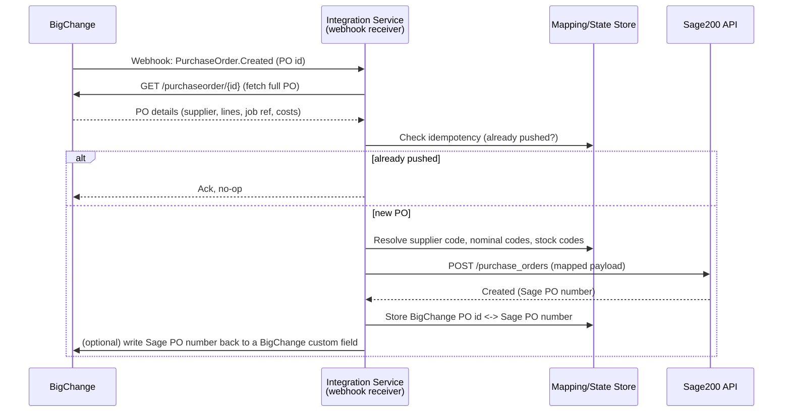

# BigChange → Sage200: Purchase Order Integration Plan

## Goal

When a purchase order (PO) is created in BigChange (JobWatch), automatically create the
matching purchase order in Sage200 — no manual re-keying.

## Open decision: which Sage200?

This is the fork in the road and needs confirming before any code is written.

| | Sage 200 Standard (cloud) | Sage 200 Professional / Extra (on-prem) |
|---|---|---|
| API | Official REST API, OAuth 2.0, JSON (`developer.sage.com/200-uk`) | No public REST API. Access is via ODBC/OData connectors (e.g. CData), the Sage 200 Business Object model, or middleware (Codat etc.) |
| Reachability | Public HTTPS endpoint — a cloud webhook receiver can call it directly | Sits inside the customer's network — the integration service must run on-prem or behind a VPN/gateway to reach it |
| Effort | Lower — well-documented REST resource for purchase orders | Higher — likely needs a locally-installed connector/agent, or a third-party middleware subscription |

**Action needed:** confirm which one is in use (check the Sage200 login screen — a
web URL means Standard; a desktop application means Professional/Extra) before Phase 1 below starts.
Everything else in this plan assumes **Sage 200 Standard**, since that's the more common
target for this kind of integration and the only one with a documented public API. If it
turns out to be Professional, the "Push to Sage200" step changes but the rest of the
pipeline (webhook receiver, mapping, idempotency) stays the same.

## Architecture (webhook-triggered)

If BigChange turns out not to support a webhook event for purchase orders specifically
(needs confirming against their developer portal — see Open Questions), fall back to a
**scheduled poll**: every N minutes, call BigChange's PO list/search endpoint filtered by
`modifiedSince`, and process anything new. The rest of the pipeline is unchanged.

## Data mapping (draft — needs field-level confirmation)

| BigChange PO field | Sage200 PO field | Notes |
|---|---|---|
| PO number / external ID | Order reference | Also stored as the idempotency key |
| Supplier | Supplier account code | Requires a supplier mapping table — BigChange supplier ≠ Sage supplier account code by default |
| Order lines (item, qty, unit cost) | Order lines (stock/product code, qty, unit price) | Requires a product/stock code mapping table |
| Job / site reference | Analysis code or order note | For cost-centre reporting back in Sage |
| Delivery address | Delivery address | May default to a fixed warehouse/site address |
| Nominal code (if set in BigChange) | Nominal code | Only if BigChange POs carry nominal coding; otherwise Sage's default per supplier/product applies |

Suppliers and stock/product codes are assumed to **already exist in both systems** — this
integration does not create master data, only transactional POs. A mapping table (BigChange
ID → Sage200 code) is required for both suppliers and products before Phase 1 can run
end-to-end.

## Key design points

- **Idempotency**: webhooks can fire more than once. Before creating a Sage PO, check a
  small state store (even a simple table/file) keyed by BigChange PO id. If already
  pushed, no-op.
- **Auth**: BigChange API key/token and Sage200 OAuth2 client credentials are both secrets
  — stored as environment variables / a secrets manager, never committed to the repo.
- **Webhook verification**: if BigChange signs its webhook payloads (HMAC), verify the
  signature before processing — otherwise the endpoint is spoofable.
- **Error handling**: failed pushes (e.g. missing supplier mapping) go to a retry queue /
  dead-letter log with alerting, rather than silently dropping the PO.
- **Traceability**: writing the resulting Sage200 PO number back to BigChange (custom
  field or note) closes the loop for whoever raised the PO.

## Open questions to resolve before building

1. **Sage200 variant** — Standard (cloud API) or Professional/Extra (on-prem)? Determines
   the entire "push" side of the architecture.
2. **BigChange webhook support** — does BigChange's API expose a `PurchaseOrder.Created`
   (or similar) webhook event, or does this need to be a scheduled poll instead? Check
   `bigchange.com/rest-api` / the BigChange developer portal, or ask BigChange support.
3. **Supplier & product mapping ownership** — who maintains the BigChange↔Sage200 code
   mapping tables, and how are they updated when new suppliers/products are added?
4. **Nominal coding** — does BigChange capture nominal codes on a PO, or does Sage200's
   default coding per supplier/product apply?
5. **Hosting** — where does the integration service run? (Cloud function is simplest for
   Sage 200 Standard; if Sage200 Professional, likely needs to run inside the customer's
   network.)
6. **Credentials** — confirm both a BigChange API key and a registered Sage200 API
   application (client id/secret) are available.

## Suggested phased rollout

1. **Phase 1 — manual/poll proof of concept**: a script that reads one known BigChange PO
   and creates the matching Sage200 PO via a one-off run. Validates field mapping and
   both APIs' auth without needing a hosted webhook endpoint yet.
2. **Phase 2 — automate the trigger**: move to a real webhook (or scheduled poll) with
   idempotency and error handling.
3. **Phase 3 — monitoring & reconciliation**: alerting on failed pushes, a daily
   reconciliation report comparing BigChange POs to Sage200 POs to catch anything missed.

## Next step

Once questions 1–3 above are answered, Phase 1 can be scaffolded as working code
(BigChange fetch + Sage200 push script) in this repo.
