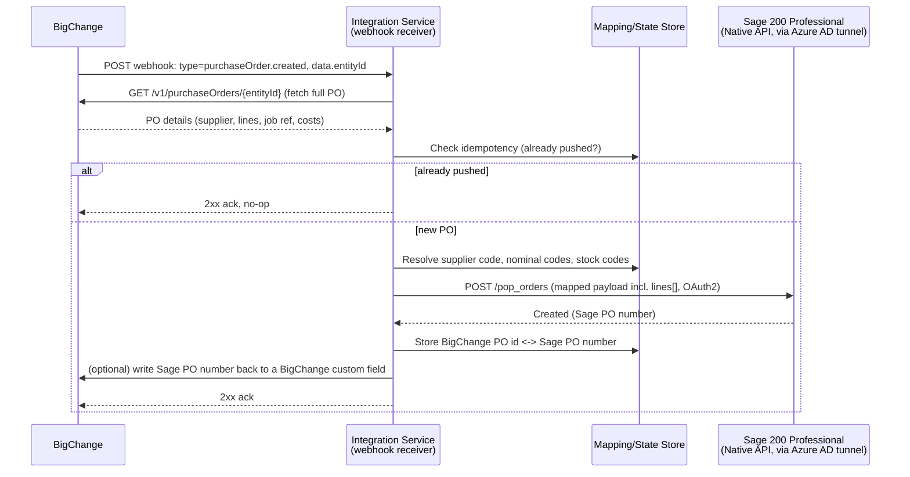

# BigChange → Sage200: Purchase Order Integration Plan

## Goal

When a purchase order (PO) is created in BigChange (JobWatch), automatically create the
matching purchase order in Sage 200 Professional — no manual re-keying.

## Confirmed: Sage 200 Professional

Sage 200 Professional (on-premise/desktop edition) **does have a REST API** — this was
corrected after initial research; middleware vendors like Codat not supporting Professional
doesn't mean no API exists, it means they haven't built a connector for it.

| | Detail |
|---|---|
| API | Sage 200 REST API, shared design across Standard and Professional (customers, suppliers, products, sales orders, **purchase orders**, nominal ledger, etc.) |
| Connection method | **Native API** — a lightweight "Azure AD Proxy Connector" installed on the Sage 200 server tunnels *outbound* to Microsoft Entra ID (Azure AD). No inbound firewall rule, no public-facing web server required |
| Requirements | A Microsoft 365 subscription (admin access to activate/configure), Sage 200 Professional Summer 2018 Remastered / 2020 R1 or later |
| Auth | OAuth 2.0 |
| Older alternative | A "Classic" connection method exposing an IIS web server directly to the internet — more setup and larger attack surface, generally superseded by the Native API |
| Base URL | `https://api.columbus.sage.com/uk/sage200extra/accounts/v1` (confirmed from the Sage 200 Professional OpenAPI spec) |

**PO write support is confirmed.** From the actual OpenAPI spec (Sage 200 Professional API,
version 2025.02):

- `POST /pop_orders` (`operationId: PostPOPOrder`) creates a purchase order. Lines are
  submitted **embedded in the same request** as a `lines[]` array — there's no separate
  "create line" call needed for a straightforward PO.
- `GET /pop_orders`, `PUT /pop_orders/{id}` also exist (list/update), plus
  `POST /pop_orders_duplicate` for cloning an existing order.
- `GET /suppliers` and `GET /products` exist as separate resources — needed because PO
  fields reference suppliers/products by **internal numeric Sage ID**, not by the
  human-readable account reference or product code (see mapping section below).

This removes the need for an on-prem Windows agent or the SDK/Business Object Model —
a hosted webhook receiver can call Sage 200 Professional's REST API in much the same way
it would Sage 200 Standard's, once the Native API tunnel is set up on the Sage 200 server
by the customer's IT/Sage partner.

## Architecture

**Webhook-triggered, confirmed against BigChange's actual webhook reference.** BigChange
has a general-purpose webhook system: you subscribe an API key to specific
`entity.operation` event types (e.g. `job.created`) via **API Key Management → Manage
webhooks** in the developer portal. Confirmed details:

- Webhook payload is deliberately thin — `{ id, createdAt, sentAt, customerId, type,
  data: { entityId } }`. It tells you *what changed*, not the full record; you then call
  the entity's `GET /v1/{entity}/{entityId}` endpoint to fetch current state.
- Child/line-item entities carry `parentEntityId`/`parentEntityType` in `data`, following
  a pattern like `GET /v1/jobs/{jobId}/lineItems/{lineItemId}` — if purchase order lines
  follow the same pattern, expect something similar for PO lines.
- BigChange handles webhook delivery retries itself: exponential backoff, capped at 15
  minutes between attempts, for up to 24 hours, then the message goes to a dead-letter
  queue accessible via their **FailedMessages** API — useful as a reconciliation backstop.
- The API key needs `webhooks:read` + `webhooks:write` scopes, plus a `*:read` scope for
  every entity subscribed to.
- **Confirmed**: `purchaseOrder.created`, `purchaseOrder.modified`, and
  `purchaseOrder.deleted` are all available as subscribable events — checked directly in
  the portal's webhook entity list.
- **Still unconfirmed**: whether webhook payloads are signed (e.g. HMAC) for verification —
  not mentioned in the reference page seen so far.

The integration service itself can now be a normal hosted service (cloud function or small
container) — it doesn't need to live inside the customer's network, since the Sage 200
Professional site is reachable via the Native API's Azure AD tunnel once that's configured.

## Data mapping (BigChange → Sage `POST /pop_orders`)

**Header (order-level) fields**, from the confirmed request schema:

| BigChange PO field | Sage `pop_orders` field | Notes |
|---|---|---|
| PO number / external ID | `document_no` (or a spare/analysis field) | Also stored as the idempotency key |
| Supplier | `supplier_id` (integer) | **Not** the supplier account code — must be resolved via `GET /suppliers` first and cached in a mapping table |
| PO date | `document_date` | ISO 8601 |
| Requested delivery date | `requested_delivery_date` | ISO 8601 |
| Job / site reference | `analysis_code_1`..`analysis_code_20` (up to 20 free-form analysis slots) | For cost-centre reporting back in Sage — pick one slot by convention |
| Delivery address | `delivery_address` (or `default_direct_delivery_address`) object — `address_1`..`address_4`, `city`, `county`, `postcode`, `contact`, etc. | May default to a fixed warehouse/site address |

**Line fields** (submitted as a `lines[]` array in the same POST):

| BigChange line field | Sage `pop_orders.lines[]` field | Notes |
|---|---|---|
| Item / product | `product_id` (integer) | **Not** the stock/product code — must be resolved via `GET /products` first and cached in a mapping table |
| Quantity | `line_quantity` | |
| Unit cost | `unit_buying_price` | |
| Description | `description` (+ `use_description` flag) | |
| Nominal code (if set in BigChange) | `nominal_reference`, `nominal_cost_centre`, `nominal_department` | Only if BigChange POs carry nominal coding; otherwise Sage's default per supplier/product applies |
| Tax/VAT rate | `tax_code_id` (integer) | Also an internal ID — needs its own lookup/mapping |

Suppliers and stock/product codes are assumed to **already exist in both systems** — this
integration does not create master data, only transactional POs. Because Sage's API
references them by internal numeric ID rather than the human-readable code, the
integration needs a **lookup step** (`GET /suppliers`, `GET /products`, filtered/matched by
code or name) before every push, with the resulting ID cached so it isn't re-resolved on
every request.

## Key design points

- **Idempotency**: BigChange retries webhook delivery on any non-2xx response (up to 24
  hours), so duplicate deliveries are expected, not just theoretical. Before creating a
  Sage PO, check a small state store (even a simple table/file) keyed by BigChange PO id.
  If already pushed, no-op and still return 2xx.
- **Respond fast, process async**: since BigChange retries on failure/timeout, the webhook
  handler should acknowledge quickly (2xx) and do the Sage push in the background — a slow
  Sage 200 API call blocking the webhook response risks BigChange treating it as a failed
  delivery and retrying unnecessarily.
- **Auth/secrets**: BigChange API key and Sage 200 OAuth2 client credentials are both
  secrets — environment variables / a secrets manager, never committed to the repo.
- **Webhook verification**: needs confirming whether BigChange signs payloads (e.g. HMAC
  header) — not seen in the reference docs so far. If not, rely on an unguessable endpoint
  URL and/or IP allowlisting instead.
- **Error handling**: failed pushes to Sage (e.g. missing supplier mapping) go to a retry
  queue / dead-letter log with alerting, rather than silently dropping the PO. BigChange's
  own FailedMessages endpoint is a useful secondary backstop for delivery-level failures.
- **Traceability**: writing the resulting Sage200 PO number back to BigChange (custom
  field or note) closes the loop for whoever raised the PO.
- **On-prem prerequisite**: someone (customer's IT or Sage partner) needs to set up the
  Native API / Azure AD Proxy Connector on the Sage 200 server before the integration
  service can reach it at all — this is a one-time setup step, not part of the code.

## Open questions to resolve before building

1. ~~Purchase Order write support~~ — **Confirmed.** `POST /pop_orders` creates a PO with
   embedded lines, per the Sage 200 Professional OpenAPI spec (v2025.02).
2. **Native API already set up?** — Confirmed as already configured on the customer's Sage
   200 site. Still need the actual OAuth2 client ID/secret from the Sage Developer account
   being created.
3. ~~BigChange webhook support~~ — **Confirmed.** `purchaseOrder.created` /
   `.modified` / `.deleted` are all available as webhook events. Still to check: whether
   payloads are signed for verification (see Key Design Points).
4. **Supplier & product mapping ownership** — who maintains the BigChange↔Sage200 code
   mapping tables, and how are they updated when new suppliers/products are added? (Now more
   concrete: this is a code/name → internal Sage numeric ID lookup, cached from `GET
   /suppliers` and `GET /products`.)
5. **Nominal coding** — does BigChange capture nominal codes on a PO, or does Sage's
   default coding per supplier/product apply?
6. **Credentials** — a BigChange API key is available. The Sage 200 OAuth2 client ID/secret
   is pending (Sage Developer account being created).

## Suggested phased rollout

1. **Phase 1 — manual proof of concept**: a script that reads one known BigChange PO (by
   ID, called manually) and creates the matching Sage200 PO via a one-off run against the
   Sage 200 Professional API. Validates field mapping and both APIs' auth without needing a
   hosted webhook endpoint yet.
2. **Phase 2 — automate the trigger**: stand up the webhook receiver, subscribe to
   `purchaseOrder.created`, add idempotency and async processing.
3. **Phase 3 — monitoring & reconciliation**: alerting on failed pushes, a daily
   reconciliation report comparing BigChange POs to Sage200 POs to catch anything missed.

## Next step

Both APIs are now fully specced — the only remaining blocker is the Sage 200 OAuth2 client
ID/secret from the Sage Developer app registration (pending, up to 72 hours). Once that
lands, Phase 1 can be scaffolded as working code in this repo.
